# 📊 ENTITY RELATIONSHIP DIAGRAM (ERD)

## Vena Pictures CRM - Database Schema

---

## 🎨 FULL ERD DIAGRAM

```mermaid
erDiagram
    %% Core Tables
    users ||--o| profiles : "has"
    users ||--o{ notifications : "receives"
    
    clients ||--o{ projects : "has"
    clients ||--o{ contracts : "has"
    clients ||--o{ leads : "converted_from"
    
    projects ||--o{ transactions : "has"
    projects ||--o{ project_team_assignments : "has"
    projects ||--o{ project_revisions : "has"
    projects ||--o{ project_sub_status_confirmations : "has"
    projects ||--o{ revision_submissions : "has"
    projects ||--o| contracts : "has"
    projects ||--o{ team_project_payments : "has"
    projects ||--o{ client_feedback : "has"
    
    packages ||--o{ projects : "used_in"
    add_ons ||--o{ projects : "added_to"
    promo_codes ||--o{ projects : "applied_to"
    
    %% Financial Tables
    cards ||--o{ transactions : "has"
    cards ||--o{ pockets : "linked_to"
    pockets ||--o{ transactions : "has"
    
    %% Team Tables
    team_members ||--o{ project_team_assignments : "assigned_to"
    team_members ||--o{ project_revisions : "handles"
    team_members ||--o{ team_project_payments : "receives"
    team_members ||--o{ team_payment_records : "has"
    team_members ||--o{ reward_ledger_entries : "has"
    team_members ||--o{ freelancer_feedback : "gives"
    
    %% Gallery Tables
    users ||--o{ galleries : "owns"
    galleries ||--o{ gallery_images : "contains"
    
    %% Table Definitions
    users {
        uuid id PK
        string email UK
        string password
        string full_name
        string role
        jsonb permissions
        jsonb restricted_cards
        boolean is_active
        timestamp last_login
        timestamp created_at
        timestamp updated_at
    }
    
    profiles {
        uuid id PK
        uuid admin_user_id FK
        string full_name
        string email
        string phone
        string company_name
        string website
        string instagram
        text address
        text bank_account
        string authorized_signer
        string id_number
        text bio
        jsonb income_categories
        jsonb expense_categories
        jsonb project_types
        jsonb event_types
        jsonb asset_categories
        jsonb sop_categories
        jsonb package_categories
        jsonb project_status_config
        jsonb notification_settings
        jsonb security_settings
        text briefing_template
        text terms_and_conditions
        text contract_template
        text package_share_template
        text booking_form_template
        jsonb chat_templates
        text logo_base64
        string brand_color
        jsonb public_page_config
        timestamp created_at
        timestamp updated_at
    }
    
    clients {
        uuid id PK
        string name
        string email
        string phone
        string whatsapp
        string instagram
        date since
        string status
        string client_type
        date last_contact
        uuid portal_access_id UK
        timestamp created_at
        timestamp updated_at
    }
    
    leads {
        uuid id PK
        string name
        string contact_channel
        string location
        string status
        date date
        text notes
        string whatsapp
        uuid converted_to_client_id FK
        timestamp converted_at
        timestamp created_at
        timestamp updated_at
    }
    
    projects {
        uuid id PK
        uuid client_id FK
        uuid package_id FK
        uuid promo_code_id FK
        string project_name
        string client_name
        string project_type
        string package_name
        string location
        date date
        date deadline_date
        time start_time
        time end_time
        string status
        integer progress
        jsonb active_sub_statuses
        jsonb confirmed_sub_statuses
        jsonb custom_sub_statuses
        string booking_status
        text rejection_reason
        decimal total_cost
        decimal amount_paid
        string payment_status
        decimal discount_amount
        string duration_selection
        decimal unit_price
        jsonb add_ons
        decimal printing_cost
        decimal transport_cost
        boolean transport_used
        boolean transport_paid
        text transport_note
        jsonb printing_details
        jsonb transport_details
        jsonb custom_costs
        jsonb team
        text drive_link
        text client_drive_link
        text final_drive_link
        text image
        text notes
        text accommodation
        text shipping_details
        boolean is_editing_confirmed_by_client
        boolean is_printing_confirmed_by_client
        boolean is_delivery_confirmed_by_client
        jsonb client_sub_status_notes
        jsonb sub_status_confirmation_sent_at
        jsonb completed_digital_items
        text dp_proof_url
        text invoice_signature
        jsonb chat_history
        timestamp created_at
        timestamp updated_at
    }
    
    packages {
        uuid id PK
        string name
        string category
        string region
        decimal price
        jsonb duration_options
        jsonb physical_items
        jsonb digital_items
        string processing_time
        string photographers
        string videographers
        decimal default_printing_cost
        decimal default_transport_cost
        text cover_image
        boolean is_active
        timestamp created_at
        timestamp updated_at
    }
    
    add_ons {
        uuid id PK
        string name
        decimal price
        string region
        text description
        boolean is_active
        timestamp created_at
        timestamp updated_at
    }
    
    promo_codes {
        uuid id PK
        string code UK
        string discount_type
        decimal discount_value
        integer max_usage
        integer usage_count
        date expiry_date
        boolean is_active
        timestamp created_at
        timestamp updated_at
    }
    
    cards {
        uuid id PK
        string card_holder_name
        string bank_name
        string last_four_digits
        string card_type
        string expiry_date
        decimal balance
        string color_gradient
        boolean is_active
        timestamp created_at
        timestamp updated_at
    }
    
    pockets {
        uuid id PK
        string name
        text description
        string icon
        string type
        decimal amount
        decimal goal_amount
        date lock_end_date
        uuid source_card_id FK
        jsonb members
        boolean is_active
        timestamp created_at
        timestamp updated_at
    }
    
    transactions {
        uuid id PK
        uuid project_id FK
        uuid card_id FK
        uuid pocket_id FK
        date date
        text description
        decimal amount
        string type
        string category
        string method
        string printing_item_id
        text vendor_signature
        timestamp created_at
        timestamp updated_at
    }
    
    team_members {
        uuid id PK
        string name
        string email
        string phone
        string role
        decimal standard_fee
        string no_rek
        decimal reward_balance
        decimal rating
        jsonb performance_notes
        uuid portal_access_id UK
        boolean is_active
        timestamp created_at
        timestamp updated_at
    }
    
    project_team_assignments {
        uuid id PK
        uuid project_id FK
        uuid team_member_id FK
        string role
        decimal fee
        decimal reward
        text sub_job
        boolean is_active
        timestamp created_at
        timestamp updated_at
    }
    
    team_project_payments {
        uuid id PK
        uuid project_id FK
        uuid team_member_id FK
        string team_member_name
        date date
        decimal fee
        decimal reward
        string status
        timestamp created_at
        timestamp updated_at
    }
    
    team_payment_records {
        uuid id PK
        uuid team_member_id FK
        string record_number UK
        date date
        decimal total_amount
        jsonb project_payment_ids
        text vendor_signature
        timestamp created_at
        timestamp updated_at
    }
    
    reward_ledger_entries {
        uuid id PK
        uuid team_member_id FK
        uuid project_id FK
        date date
        text description
        decimal amount
        timestamp created_at
        timestamp updated_at
    }
    
    contracts {
        uuid id PK
        uuid client_id FK
        uuid project_id FK
        string contract_number UK
        date signing_date
        string signing_location
        string client_name_1
        text client_address_1
        string client_phone_1
        string client_name_2
        text client_address_2
        string client_phone_2
        string shooting_duration
        string guaranteed_photos
        text album_details
        string digital_files_format
        text other_items
        string personnel_count
        string delivery_timeframe
        date dp_date
        date final_payment_date
        text cancellation_policy
        string jurisdiction
        text vendor_signature
        text client_signature
        timestamp created_at
        timestamp updated_at
    }
    
    sops {
        uuid id PK
        string title
        string category
        text content
        timestamp last_updated
        timestamp created_at
        timestamp updated_at
    }
    
    project_revisions {
        uuid id PK
        uuid project_id FK
        uuid freelancer_id FK
        date date
        date deadline
        text admin_notes
        string status
        text freelancer_notes
        text drive_link
        date completed_date
        timestamp created_at
        timestamp updated_at
    }
    
    project_sub_status_confirmations {
        uuid id PK
        uuid project_id FK
        string sub_status_name
        timestamp confirmed_at
        text client_note
        timestamp created_at
    }
    
    revision_submissions {
        uuid id PK
        uuid project_id FK
        timestamp submitted_at
        text revision_notes
        text reference_links
        string status
        timestamp created_at
        timestamp updated_at
    }
    
    client_feedback {
        uuid id PK
        string client_name
        string satisfaction
        integer rating
        text feedback
        date date
        uuid project_id FK
        timestamp created_at
        timestamp updated_at
    }
    
    freelancer_feedback {
        uuid id PK
        uuid freelancer_id FK
        string team_member_name
        date date
        text message
        timestamp created_at
        timestamp updated_at
    }
    
    galleries {
        uuid id PK
        uuid user_id FK
        string title
        string region
        text description
        boolean is_public
        uuid public_id UK
        text booking_link
        timestamp created_at
        timestamp updated_at
    }
    
    gallery_images {
        uuid id PK
        uuid gallery_id FK
        text url
        text thumbnail_url
        text caption
        timestamp uploaded_at
        integer display_order
        timestamp created_at
        timestamp updated_at
    }
    
    notifications {
        uuid id PK
        string title
        text message
        string icon
        jsonb link
        boolean is_read
        timestamp timestamp
        timestamp created_at
    }
```

---

## 🔗 RELATIONSHIP SUMMARY

### **One-to-One (1:1)**
- `users` → `profiles`
- `projects` → `contracts`

### **One-to-Many (1:N)**
- `clients` → `projects`
- `clients` → `contracts`
- `projects` → `transactions`
- `projects` → `team_project_payments`
- `projects` → `project_revisions`
- `cards` → `transactions`
- `team_members` → `reward_ledger_entries`
- `galleries` → `gallery_images`

### **Many-to-Many (M:N)**
- `projects` ↔ `team_members` (via `project_team_assignments`)
- `projects` ↔ `add_ons` (via JSONB in projects)

---

## 📊 CARDINALITY NOTATION

- `||--o|` : One-to-One (optional)
- `||--||` : One-to-One (required)
- `||--o{` : One-to-Many (optional)
- `||--{` : One-to-Many (required)
- `}o--o{` : Many-to-Many (optional)

---

**Generated**: 2025-10-23  
**Tool**: Mermaid ERD  
**Database**: PostgreSQL (Supabase)
